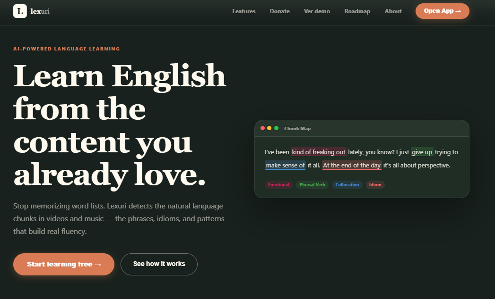

# Lexuri — Turn real content into English fluency



> AI-powered English learning platform. You bring the content you already enjoy — YouTube videos, songs, podcasts. Lexuri extracts every idiom, phrasal verb, and collocation, and burns them into long-term memory through spaced repetition.

**[lexuri.app](https://lexuri.app)** · Built solo · TypeScript end-to-end

---

## The Problem

Most learners plateau because they study vocabulary in isolation — words, definitions, flashcards. But native fluency isn't about words. It's about *chunks*: the multi-word expressions that native speakers reach for without thinking.

> *"make sense of"* · *"at the end of the day"* · *"take it for granted"*

These patterns live inside the content people already consume. The bottleneck is extracting and retaining them at scale. Until now, that required a human tutor or hours of manual annotation.

**Lexuri automates the entire extraction and retention loop.**

---

## How It Works

```
Content you already enjoy
        ↓
AI scans transcript for real language patterns
        ↓
You save the chunks that matter
        ↓
SM-2 spaced repetition brings them back at the right moment
        ↓
You start speaking the way that content sounds
```

Paste a YouTube URL. Lexuri fetches the full transcript, syncs it with the player, and lets GPT-4o highlight every chunk worth learning — with meaning, context, CEFR level, and importance rating. Pick your own or let the AI choose. Turn them into flashcards in one click. Review on your schedule.

Same pipeline for song lyrics via Genius.

---

## Features

| Area | Feature | What it does |
|---|---|---|
| AI | **Chunk Detection** | GPT-4o identifies idioms, phrasal verbs, collocations — with meaning, usage context, CEFR level, and importance rating |
| AI | **Flashcard Generation** | Converts chunks into structured flashcards with translation in the user's native language |
| Import | **YouTube Studio** | Full transcript synchronized with the player — collect chunks by click or let AI scan everything |
| Import | **Music Lab** | Genius API integration — same AI pipeline applied to song lyrics |
| Learning | **Spaced Repetition (SM-2)** | Cards surface at the optimal retention moment using the proven SM-2 algorithm |
| Learning | **Graded Review** | 4-quality ratings (Again / Hard / Good / Easy); response time factors into next interval |
| Content | **Curated Feed** | 19 hand-picked TED Talks and songs, tagged by CEFR level A1–C1 |
| Progress | **Gamification** | XP, streaks, daily bonuses, milestone badges, weekly/monthly/all-time leaderboard |
| Progress | **Performance Reports** | Accuracy rate, retention curve, average response time, review volume |
| UX | **Offline Mode** | IndexedDB queue + Service Worker — reviews queue offline and sync on reconnect |
| Onboarding | **Placement** | 4-step onboarding: native language, CEFR level, learning objectives |
| Billing | **Free / Pro / Premium** | Stripe Checkout + Customer Portal — self-serve upgrades and downgrades |
| Notifications | **Daily Reminders** | Real-time bell + email reminders via Resend |

---

## Business Model

Three tiers. One Stripe integration. Self-serve from day one.

| Tier | What's included |
|---|---|
| **Free** | Limited AI analyses per week, core SRS, curated feed |
| **Pro** | Unlimited YouTube + Music, full AI chunk detection, expanded history |
| **Premium** | Everything in Pro + priority AI (GPT-4o) + advanced exports |

Stripe Checkout handles upgrades. Customer Portal handles everything else — plan changes, billing history, cancellation — without involving support.

---

## Tech Stack

Built end-to-end by one developer.

| Layer | Technology |
|---|---|
| Framework | Next.js 16 — App Router, Server Components, TypeScript, React 19 |
| Styling | Tailwind CSS v4 |
| Database & Auth | Supabase — Postgres + Row Level Security + Auth + Realtime |
| AI | GPT-4o (chunk detection), GPT-4o-mini (flashcard generation), Whisper (audio transcription fallback) |
| Payments | Stripe Checkout, Customer Portal, Webhooks |
| Email | Resend + React Email |
| Offline | IndexedDB + Service Worker |
| Deployment | Vercel |

---

## Architecture & Transparency

The source code is open. Here is how the product actually works under the hood.

**Server-first rendering** — Data fetching runs on the server by default. Client components are isolated to interactive surfaces only. Lean bundle, fast initial load, no prop-drilling through the tree.

**Database-level security** — Every Postgres query is scoped to the authenticated user via Row Level Security at the database layer — not just in application code. 9 migrations, all tables with RLS active.

**SM-2 fidelity** — Spaced repetition tracks `ease_factor`, `interval`, and `repetitions` exactly as the algorithm specifies. Response time is measured client-side and sent to the server. Gamification scoring is fully server-side — no client trust for points.

**Offline-first reviews** — Review actions queue in IndexedDB when the connection drops. On reconnect, `/api/offline/sync` processes the queue with idempotent conflict resolution keyed by client UUID. Last-write-wins.

**LLM robustness** — Every AI response goes through structured JSON extraction and validation before use. Chunk detection returns character offsets, type, CEFR level, and importance — all validated server-side before reaching the database.

**Auth coverage** — Email + password with strength validation, Google and GitHub OAuth, email verification, forgot/reset password, active session listing with individual revocation, and account deletion with cascade.

---

## Roadmap

**PWA (near-term)** — The app already has a Service Worker and a fully responsive layout. Converting to an installable PWA delivers native-feeling mobile without a second codebase.

**Rate limiting by plan** — AI routes currently apply soft limits. Hard enforcement at the API layer per subscription tier is the next infrastructure piece before scaling.

**Flutter app (medium-term)** — Nearly all business logic lives in REST API Routes. The backend is already mobile-ready: offline sync was designed with mobile in mind, SM-2 is pure calculation, Supabase has an official Flutter SDK. The only heavy lift is reimplementing the synchronized YouTube transcript player. The architecture supports a Flutter client without backend refactoring.

**LMS Integration** — The endpoint is built (REST API, no UI yet). Integration with institutional LMS platforms opens an EdTech B2B channel.

---

## About

Lexuri is an independent product built by a single developer. The codebase is publicly visible for portfolio and transparency purposes — not as an open-source project.

This is not a side project looking for contributors. It's a live product at [lexuri.app](https://lexuri.app) seeking traction, validation, and the right partners.

---

## Contact

For partnerships, investment conversations, or integration inquiries:

**natanoliveiraad855@gmail.com**

---

## License

Copyright © 2026 Natan Oliveira — All rights reserved.

Source code is publicly visible for portfolio and transparency purposes. The platform, brand, and product are not open for redistribution or commercial use without written permission.
